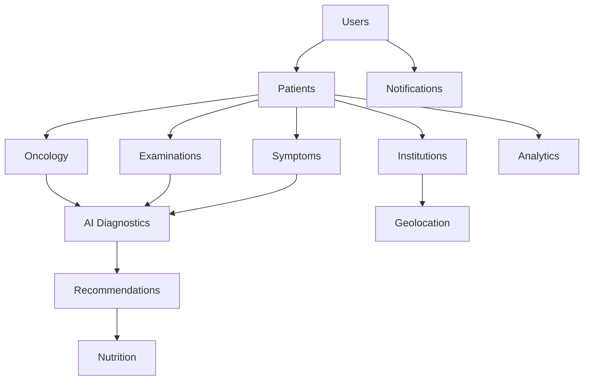

# 🏥 Medical Modules Specification

## 🎯 **Dominios y Módulos Médicos Completos**

### 🔐 **1. USERS & AUTH MODULE** (Mejorado)
**Responsabilidad**: Gestión de usuarios, autenticación y autorización avanzada

#### Entidades Principales:
```typescript
// Roles expandidos para el contexto médico
enum UserRole {
  PATIENT = 'patient',
  DOCTOR = 'doctor',
  NURSE = 'nurse',
  ADMIN = 'admin',
  INSTITUTION_ADMIN = 'institution_admin',
  RESEARCHER = 'researcher',
  CAREGIVER = 'caregiver'
}

// Usuario base con perfiles especializados
class User {
  id: string;
  email: string;
  roles: UserRole[];
  institutionId?: string; // Multi-tenancy
  profile: UserProfile; // Polimórfico según rol
}
```

#### Casos de Uso:
- Registro multi-rol
- Autenticación con MFA
- Autorización granular (RBAC + ABAC)
- Gestión de perfiles especializados

---

### 👤 **2. PATIENTS MODULE** 
**Responsabilidad**: Gestión integral de pacientes oncológicos

#### Entidades Principales:
```typescript
class Patient {
  id: string;
  userId: string; // Referencia a User
  personalInfo: PersonalInfo;
  medicalHistory: MedicalHistory;
  oncologyProfile: OncologyProfile;
  caregivers: Caregiver[];
  privacySettings: PrivacySettings;
}

class OncologyProfile {
  cancerType: CancerType;
  stage: CancerStage;
  diagnosisDate: Date;
  treatment: TreatmentPlan;
  prognosis: PrognosisInfo;
}
```

#### Casos de Uso:
- Registro de pacientes
- Gestión de historiales médicos
- Configuración de privacidad
- Vinculación con cuidadores
- Seguimiento de tratamientos

---

### 🎗️ **3. ONCOLOGY MODULE**
**Responsabilidad**: Dominio especializado en oncología

#### Sub-dominios:
```
oncology/
├── cancer-types/      # Tipos de cáncer
├── staging/           # Estadificación
├── treatments/        # Tratamientos disponibles
├── protocols/         # Protocolos médicos
└── research/          # Investigación y estudios
```

#### Entidades Principales:
```typescript
class CancerType {
  id: string;
  name: string;
  category: CancerCategory;
  symptoms: Symptom[];
  riskFactors: RiskFactor[];
  treatments: Treatment[];
}

class TreatmentPlan {
  id: string;
  patientId: string;
  treatments: Treatment[];
  schedule: TreatmentSchedule;
  sideEffects: SideEffect[];
  effectiveness: EffectivenessMetrics;
}
```

#### Casos de Uso:
- Catalogación de tipos de cáncer
- Creación de planes de tratamiento
- Seguimiento de protocolos
- Análisis de efectividad
- Investigación oncológica

---

### 🔬 **4. EXAMINATIONS MODULE**
**Responsabilidad**: Gestión de exámenes médicos y resultados

#### Entidades Principales:
```typescript
class MedicalExamination {
  id: string;
  patientId: string;
  type: ExaminationType;
  scheduledDate: Date;
  performedDate?: Date;
  results: ExaminationResult[];
  aiAnalysis?: AIAnalysisResult;
  doctorNotes: string;
}

enum ExaminationType {
  BLOOD_TEST = 'blood_test',
  IMAGING = 'imaging',
  BIOPSY = 'biopsy',
  CT_SCAN = 'ct_scan',
  MRI = 'mri',
  PET_SCAN = 'pet_scan'
}
```

#### Casos de Uso:
- Programación de exámenes
- Interpretación automática con IA
- Comparación histórica de resultados
- Alertas de valores críticos
- Integración con laboratorios

---

### 🤖 **5. AI DIAGNOSTICS MODULE**
**Responsabilidad**: Inteligencia artificial para diagnóstico y recomendaciones

#### Servicios de IA:
```typescript
interface AIService {
  analyzeSymptoms(symptoms: Symptom[]): Promise<DiagnosticSuggestion[]>;
  interpretExamination(exam: MedicalExamination): Promise<AIAnalysisResult>;
  recommendTreatment(patient: Patient): Promise<TreatmentRecommendation[]>;
  predictRisk(patient: Patient): Promise<RiskAssessment>;
}

class AIAnalysisResult {
  confidence: number;
  findings: Finding[];
  recommendations: Recommendation[];
  riskFactors: RiskFactor[];
  followUpSuggestions: string[];
}
```

#### Capacidades:
- **NLP para síntomas**: Procesamiento de lenguaje natural
- **Análisis de imágenes**: Radiografías, tomografías, resonancias
- **Predicción de riesgo**: Modelos de machine learning
- **Recomendaciones personalizadas**: IA adaptativa

---

### 💊 **6. RECOMMENDATIONS MODULE**
**Responsabilidad**: Motor de recomendaciones personalizadas

#### Tipos de Recomendaciones:
```typescript
enum RecommendationType {
  MEDICATION = 'medication',
  LIFESTYLE = 'lifestyle',
  NUTRITION = 'nutrition',
  EXERCISE = 'exercise',
  FOLLOW_UP = 'follow_up',
  EMERGENCY = 'emergency'
}

class PersonalizedRecommendation {
  id: string;
  patientId: string;
  type: RecommendationType;
  content: RecommendationContent;
  priority: Priority;
  evidenceLevel: EvidenceLevel;
  aiGenerated: boolean;
}
```

#### Casos de Uso:
- Recomendaciones basadas en IA
- Personalización por perfil del paciente
- Integración con planes de tratamiento
- Seguimiento de adherencia
- Retroalimentación del paciente

---

### 🥗 **7. NUTRITION MODULE**
**Responsabilidad**: Nutrición especializada para pacientes oncológicos

#### Entidades Principales:
```typescript
class NutritionPlan {
  id: string;
  patientId: string;
  dietType: DietType;
  restrictions: DietaryRestriction[];
  goals: NutritionGoal[];
  meals: MealPlan[];
  supplements: Supplement[];
}

class NutritionAnalysis {
  patientId: string;
  currentStatus: NutritionalStatus;
  deficiencies: NutritionalDeficiency[];
  recommendations: NutritionRecommendation[];
}
```

#### Características:
- Planes nutricionales personalizados
- Recetas adaptadas al tratamiento
- Seguimiento de ingesta calórica
- Manejo de efectos secundarios
- Integración con wearables

---

### 📋 **8. SYMPTOMS MODULE**
**Responsabilidad**: Seguimiento y análisis de síntomas

#### Entidades Principales:
```typescript
class SymptomEntry {
  id: string;
  patientId: string;
  symptoms: SymptomRecord[];
  timestamp: Date;
  severity: SeverityLevel;
  context: SymptomContext;
  aiAnalysis?: SymptomAnalysis;
}

class SymptomPattern {
  patientId: string;
  patterns: Pattern[];
  triggers: Trigger[];
  trends: Trend[];
  alerts: SymptomAlert[];
}
```

#### Casos de Uso:
- Registro diario de síntomas
- Detección de patrones con IA
- Alertas tempranas
- Correlación con tratamientos
- Reportes para médicos

---

### 🏥 **9. INSTITUTIONS MODULE**
**Responsabilidad**: Gestión de centros médicos y profesionales

#### Entidades Principales:
```typescript
class MedicalInstitution {
  id: string;
  name: string;
  type: InstitutionType;
  location: Location;
  specialties: MedicalSpecialty[];
  professionals: MedicalProfessional[];
  services: MedicalService[];
  rating: InstitutionRating;
}

class MedicalProfessional {
  id: string;
  userId: string;
  specialties: MedicalSpecialty[];
  credentials: Credential[];
  availability: Availability;
  patients: PatientAssignment[];
}
```

#### Funcionalidades:
- Directorio de centros médicos
- Gestión de profesionales
- Sistema de citas
- Ratings y reseñas
- Multi-tenancy por institución

---

### 🌍 **10. GEOLOCATION MODULE**
**Responsabilidad**: Servicios de ubicación y mapas

#### Servicios:
```typescript
interface GeolocationService {
  findNearbyInstitutions(
    location: Coordinates, 
    specialties: MedicalSpecialty[],
    radius: number
  ): Promise<NearbyInstitution[]>;
  
  calculateRoute(
    origin: Location, 
    destination: Location
  ): Promise<RouteInfo>;
  
  getLocationInsights(
    patientId: string
  ): Promise<LocationInsights>;
}
```

#### Características:
- Búsqueda geoespacial optimizada
- Integración con Google Maps/OpenStreetMap
- Rutas optimizadas para pacientes
- Análisis de accesibilidad
- Notificaciones de proximidad

---

### 📱 **11. NOTIFICATIONS MODULE**
**Responsabilidad**: Sistema de notificaciones inteligentes

#### Tipos de Notificaciones:
```typescript
enum NotificationType {
  MEDICATION_REMINDER = 'medication_reminder',
  APPOINTMENT_REMINDER = 'appointment_reminder',
  SYMPTOM_ALERT = 'symptom_alert',
  TREATMENT_UPDATE = 'treatment_update',
  EMERGENCY_ALERT = 'emergency_alert',
  RESEARCH_UPDATE = 'research_update'
}

class IntelligentNotification {
  id: string;
  recipientId: string;
  type: NotificationType;
  content: NotificationContent;
  priority: Priority;
  scheduledTime: Date;
  personalizedContent: boolean;
}
```

---

### 📊 **12. ANALYTICS MODULE**
**Responsabilidad**: Métricas, reportes y business intelligence

#### Capacidades:
- Dashboard para pacientes
- Reportes para médicos
- Analytics de población
- Métricas de calidad de vida
- Indicadores de salud pública

---

## 🔄 **Relaciones entre Módulos**



---

## 🎯 **Priorización para Desarrollo**

### **Sprint 1-2: Fundación** (4 semanas)
1. Users & Auth (mejorado)
2. Patients (básico)
3. Institutions (básico)

### **Sprint 3-4: Core Médico** (4 semanas)
1. Oncology (completo)
2. Symptoms (básico)
3. Examinations (básico)

### **Sprint 5-6: IA y Recomendaciones** (4 semanas)
1. AI Diagnostics (MVP)
2. Recommendations (básico)
3. Nutrition (básico)

### **Sprint 7-8: Servicios Avanzados** (4 semanas)
1. Geolocation (completo)
2. Notifications (completo)
3. Analytics (básico)

**🚀 Con esta estructura modular, tendrás una plataforma médica robusta, escalable y centrada en el paciente oncológico.**